# Current Backend Architecture

This document describes the backend components that currently exist in the project
and how the initial React frontend connects to them. It intentionally documents
the implemented state only, not future planned features.

## System Context

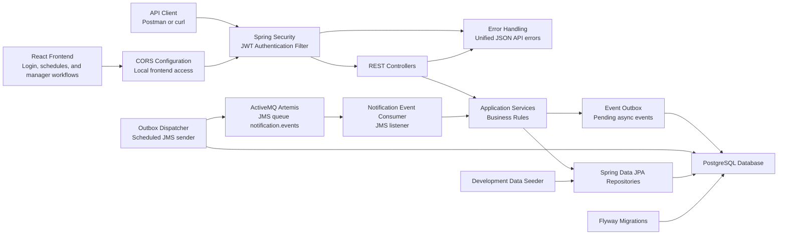

## Frontend Integration

The current frontend is intentionally small. It is responsible for:

- Displaying the login form.
- Calling `POST /api/auth/login`.
- Storing the returned JWT in browser local storage.
- Sending the JWT as a bearer token for authenticated API calls.
- Showing a manager or employee workspace based on the authenticated user's role.
- Loading the signed-in user's published schedules from `GET /api/schedules/me/published`.
- Loading a manager's teams from `GET /api/teams/me/managed`.
- Creating draft schedules through `POST /api/schedules`.
- Loading managed draft schedules from `GET /api/schedules/me/managed/drafts`.
- Deleting manager-owned draft schedules through `DELETE /api/schedules/{scheduleId}`.
- Loading a manager's published schedule details from `GET /api/schedules/me/managed/published/{scheduleId}`.
- Creating shifts through `POST /api/schedules/{scheduleId}/shifts`.
- Loading draft schedule shifts from `GET /api/schedules/{scheduleId}/shifts`.
- Loading active team employees from `GET /api/teams/{teamId}/employees`.
- Loading draft schedule assignments from `GET /api/schedules/{scheduleId}/assignments`.
- Creating manual assignments through `POST /api/assignments`.
- Removing draft assignments through `DELETE /api/assignments/{assignmentId}`.
- Running basic automatic assignment through `POST /api/schedules/{scheduleId}/auto-assign`.
- Creating and managing reusable shift templates through the template endpoints.
- Deleting unused templates through `DELETE /api/templates/{templateId}`.
- Loading personal notifications from `GET /api/notifications`.
- Loading unread notification count from `GET /api/notifications/unread-count`.
- Marking a personal notification as read through `POST /api/notifications/{notificationId}/read`.
- Receiving request-created notifications for transfer and swap requests through JMS.
- Loading transfer and swap request lists from `GET /api/requests/me/outgoing`, `GET /api/requests/me/incoming`, and `GET /api/requests/manager` for managers.
- Creating employee transfer and swap requests through `POST /api/requests/transfers` and `POST /api/requests/swaps`.
- Running transfer and swap request actions through employee approve/reject, requester cancel, and manager approve endpoints.

The backend remains the authority for authentication, authorization, validation,
business rules, and persistence.

## Backend Packages

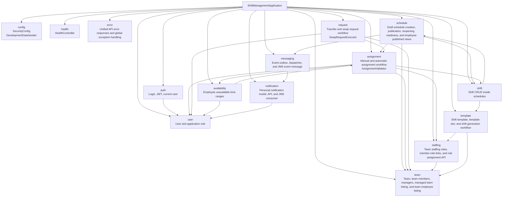

## Layer Pattern

Most feature packages follow this pattern:

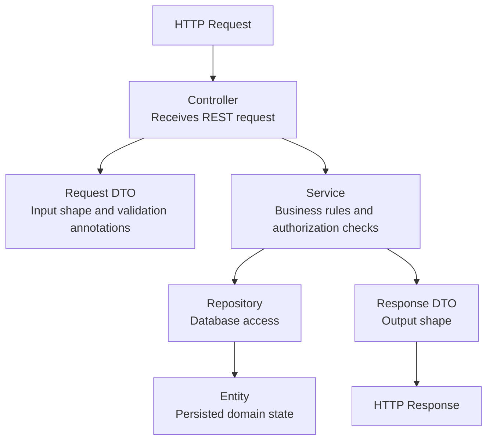

Not every package has every layer yet.
For example, the basic schedule lifecycle, publication readiness report, explicit unfilled-publication confirmation, and employee/manager published schedule views are already implemented.

## Error Handling

API errors use a unified JSON response through the `error` package. Controller-level
exceptions are handled by `GlobalExceptionHandler`, while Spring Security
authentication and authorization failures write the same response shape directly
from `SecurityConfig`.

The response includes:

- HTTP status and reason.
- A stable error code.
- A human-readable message.
- The request path.
- A timestamp.

Assignment business validation now uses the same response shape as the rest of
the API, while preserving business codes such as `SHIFT_OVERLAP` and
`MINIMUM_REST`.

## Operational Logging

The backend uses Spring Boot's default SLF4J logging for focused business events.
Current logging is intentionally limited to workflow checkpoints:

- Schedule creation, publication, reopening, and manager-only deletion of draft schedules.
- Assignment creation and deletion.
- Template and template slot creation, template-based shift generation, and safe deletion of unused templates.
- Transfer and swap request creation, employee and manager scoped request lists, approval, rejection, cancellation, invalidation, assignment transfer execution, and assignment swap execution.
- Outbox event dispatch and schedule-published notification creation.

Logs include operational identifiers such as schedule IDs, assignment IDs, user IDs,
team IDs, event IDs, and request IDs. They do not log passwords, JWT tokens, or full
request payloads.

## Domain Model

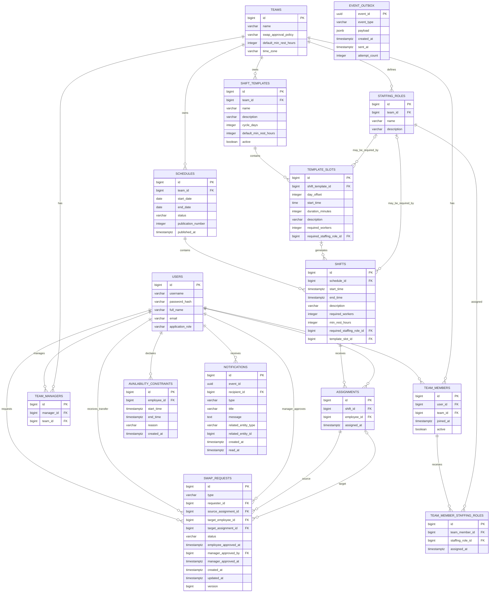

## Implemented API Areas

```mermaid
flowchart TD
    api["REST API"]

    healthApi["Health<br/>GET /api/health"]
    authApi["Authentication<br/>POST /api/auth/login<br/>GET /api/auth/me"]
    teamsApi["Teams<br/>GET /api/teams/me/managed"]
    schedulesApi["Schedules<br/>POST /api/schedules<br/>GET /api/schedules/me/published<br/>GET /api/schedules/me/published/{scheduleId}<br/>GET /api/schedules/me/managed/drafts<br/>GET /api/schedules/me/managed/published/{scheduleId}<br/>GET /api/schedules/{scheduleId}/publication-readiness<br/>POST /api/schedules/{scheduleId}/publish<br/>POST /api/schedules/{scheduleId}/reopen<br/>DELETE /api/schedules/{scheduleId}"]
    shiftsApi["Shifts<br/>POST /api/schedules/{scheduleId}/shifts<br/>GET /api/schedules/{scheduleId}/shifts<br/>PUT /api/schedules/{scheduleId}/shifts/{shiftId}<br/>DELETE /api/schedules/{scheduleId}/shifts/{shiftId}"]
    assignmentsApi["Assignments<br/>POST /api/assignments<br/>GET /api/schedules/{scheduleId}/assignments<br/>POST /api/schedules/{scheduleId}/auto-assign<br/>DELETE /api/assignments/{assignmentId}"]
    availabilityApi["Availability Constraints<br/>POST /api/availability-constraints<br/>GET /api/availability-constraints/me<br/>DELETE /api/availability-constraints/{constraintId}"]
    staffingApi["Staffing Roles<br/>POST /api/teams/{teamId}/staffing-roles<br/>GET /api/teams/{teamId}/staffing-roles<br/>POST /api/teams/{teamId}/employees/{employeeId}/staffing-roles<br/>GET /api/teams/{teamId}/employees/{employeeId}/staffing-roles"]
    templatesApi["Templates<br/>POST /api/teams/{teamId}/templates<br/>GET /api/teams/{teamId}/templates<br/>POST /api/templates/{templateId}/slots<br/>GET /api/templates/{templateId}/slots<br/>POST /api/templates/{templateId}/generate<br/>DELETE /api/templates/{templateId}"]
    notificationApi["Notifications<br/>GET /api/notifications<br/>GET /api/notifications/unread-count<br/>POST /api/notifications/{notificationId}/read"]
    requestsApi["Requests<br/>POST /api/requests/transfers<br/>POST /api/requests/swaps<br/>GET /api/requests/me/outgoing<br/>GET /api/requests/me/incoming<br/>GET /api/requests/manager<br/>GET /api/requests/manager/pending<br/>POST /api/requests/{requestId}/employee-approve<br/>POST /api/requests/{requestId}/employee-reject<br/>POST /api/requests/{requestId}/manager-approve<br/>POST /api/requests/{requestId}/cancel"]

    api --> healthApi
    api --> authApi
    api --> teamsApi
    api --> schedulesApi
    api --> shiftsApi
    api --> assignmentsApi
    api --> availabilityApi
    api --> staffingApi
    api --> templatesApi
    api --> notificationApi
    api --> requestsApi
```

Assignment creation validates required staffing roles when a shift has a professional role requirement.

## Main Request Flow Examples

### Login

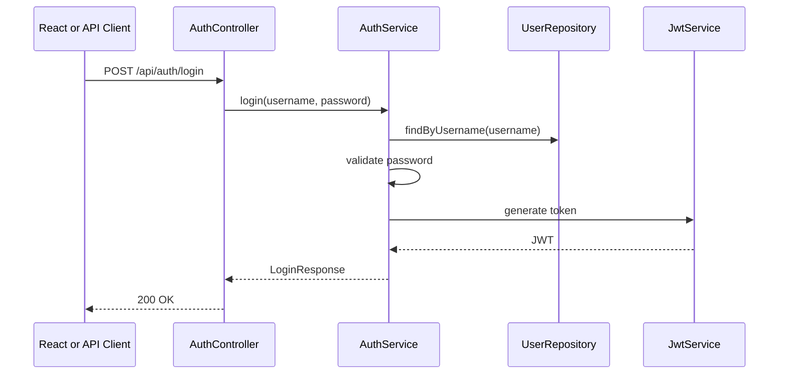

### Schedule Publication

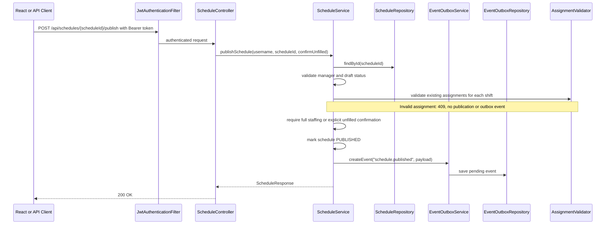

The JMS delivery step happens asynchronously after the publish request returns.

### Outbox JMS Notification Delivery

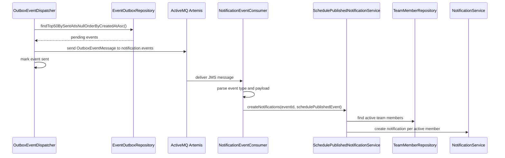

### Notification List And Read State

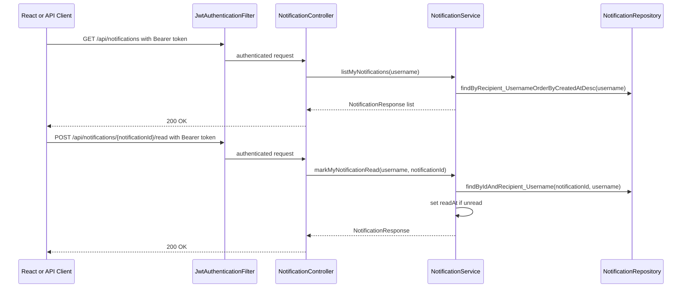

### Publication Readiness

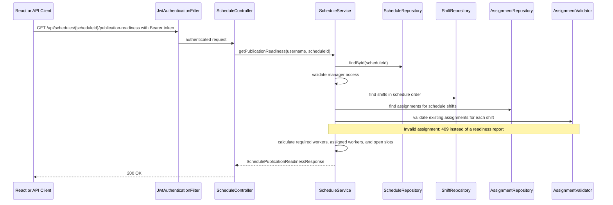

Readiness and publication share `AssignmentValidator.validateExistingAssignments`.
It checks capacity, active membership, required role, availability, overlap, and
minimum rest using the existing rules. The current assignment is excluded from
overlap/rest queries, and a fully staffed shift is valid. `confirmUnfilled` only
permits open slots; it never bypasses eligibility checks. Validation failure
leaves the draft and publication number unchanged and creates no outbox event.

### Shift Editing

`ShiftService.updateShift` checks manager ownership, draft status, the schedule
date range, and the required role's team before applying the proposed fields.
It then loads the shift's existing assignments and calls the same validator in
the service transaction. An eligibility or excess-capacity conflict propagates
as `409`; rollback restores every edited field, including any changes Hibernate
flushed while running validation queries. Assignment owners are not changed.

These checks reject invalid sequential operations and legacy inconsistent data;
they do not yet coordinate every concurrent write. Availability versus assignment,
publication/reopening versus writes, and stale edits/deletions remain part 4 of
the remediation roadmap.

### Schedule Reopening

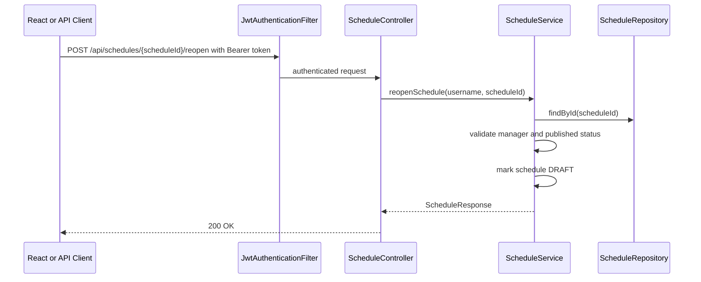

### Employee Published Schedule List

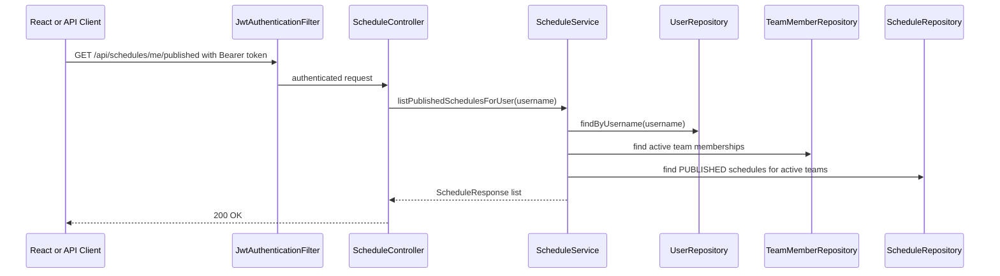

### Employee Published Schedule Details

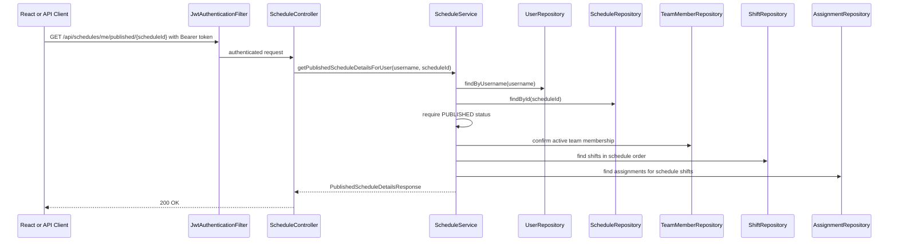

### Manual Assignment

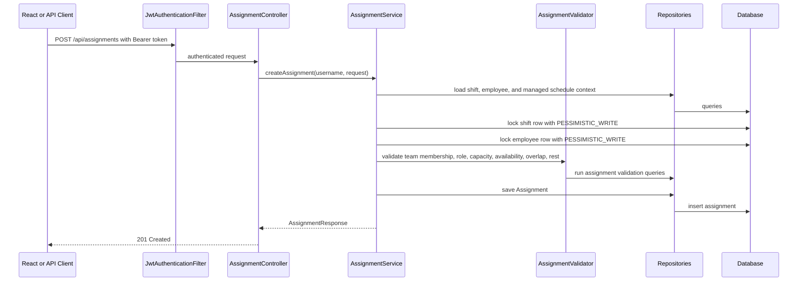

Manual and automatic assignment workflows acquire a PostgreSQL row-level
`PESSIMISTIC_WRITE` lock before checking shift capacity. The lock is held by the
transaction until it completes, so concurrent assignment requests for the same
shift are serialized. This prevents two requests from both seeing the same open
slot and inserting assignments beyond `requiredWorkers`.

Both workflows also lock the employee row before assignment validation. A second
assignment for that employee waits for the first transaction and then checks the
committed overlap/rest state, including assignments in another schedule.
Automatic assignment acquires all shift locks in ascending shift ID order, then
all candidate employee locks in ascending user ID order. Assignment processing
still uses chronological shift order and the existing workload ranking.

Transfer/swap execution uses the same shift-then-employee lock order, as described
below. This is not a blanket guarantee for every write path: concurrent
availability changes and shift editing/publication remain separate remediation
steps. PostgreSQL regression tests run with `mvn verify -Ppostgres-it` from the
backend directory.

### Availability Constraint

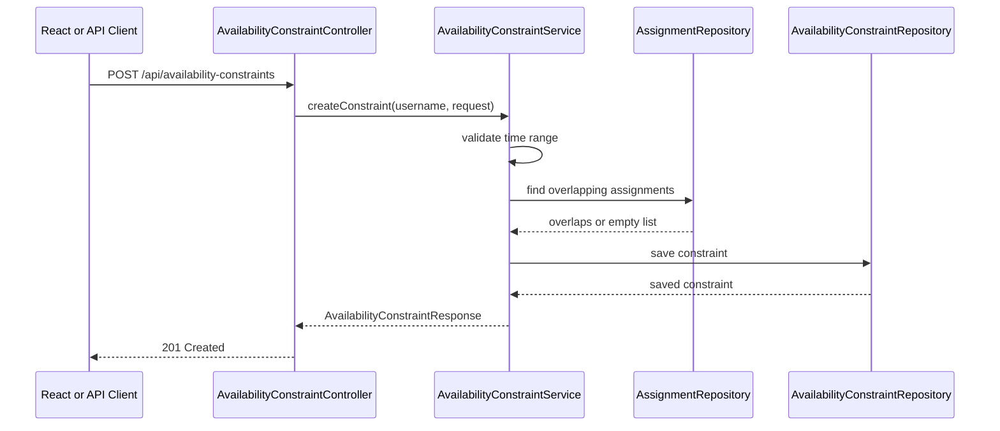

### Transfer Request Creation

```mermaid
sequenceDiagram
    participant Client as React or API Client
    participant Security
    participant SwapRequestController
    participant SwapRequestService
    participant Repositories
    participant Database

    Client->>Security: POST /api/requests/transfers with Bearer token
    Security->>SwapRequestController: authenticated request
    SwapRequestController->>SwapRequestService: createTransferRequest(username, request)
    SwapRequestService->>Repositories: load requester and source assignment
    Repositories->>Database: queries
    SwapRequestService->>Database: lock source team through SwapRequestLock; refresh source state
    SwapRequestService->>Repositories: load target employee
    SwapRequestService->>SwapRequestService: validate employee requester, ownership, published schedule, target team membership, no active request
    SwapRequestService->>Repositories: save SwapRequest
    Repositories->>Database: insert swap_requests row
    SwapRequestService-->>SwapRequestController: SwapRequestResponse
    SwapRequestController-->>Client: 201 Created
```

### Swap Request Creation

```mermaid
sequenceDiagram
    participant Client as React or API Client
    participant Security
    participant SwapRequestController
    participant SwapRequestService
    participant Repositories
    participant Database

    Client->>Security: POST /api/requests/swaps with Bearer token
    Security->>SwapRequestController: authenticated request
    SwapRequestController->>SwapRequestService: createSwapRequest(username, request)
    SwapRequestService->>Repositories: load requester and source assignment
    Repositories->>Database: queries
    SwapRequestService->>Database: lock source team through SwapRequestLock; refresh source state
    SwapRequestService->>Repositories: load target assignment
    SwapRequestService->>SwapRequestService: validate ownership, published schedules, same team, target membership, no active requests
    SwapRequestService->>Repositories: save SwapRequest
    Repositories->>Database: insert swap_requests row with target_assignment_id
    SwapRequestService-->>SwapRequestController: SwapRequestResponse
    SwapRequestController-->>Client: 201 Created
```

### Transfer Request Target Approval

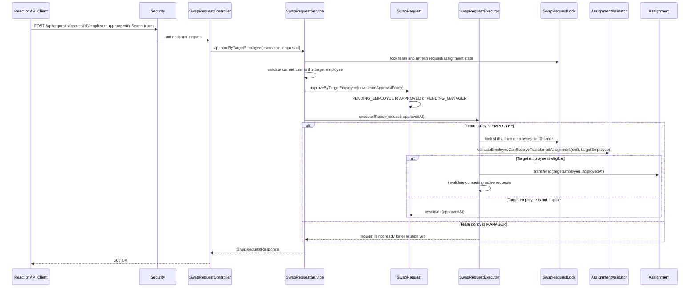

### Transfer Request Manager Approval

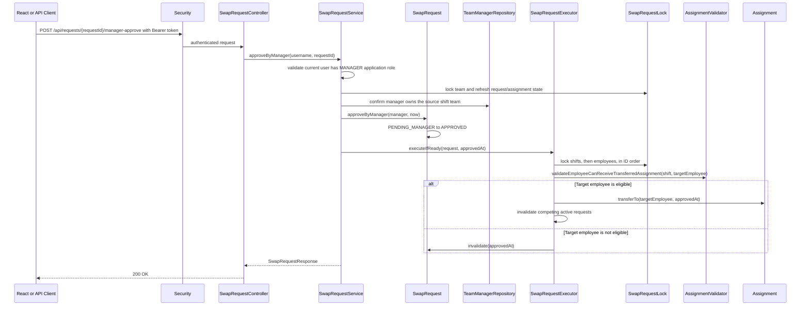

The same approval endpoints handle `SWAP` requests. For swaps, final execution
validates both resulting assignments while ignoring the assignment each employee
is giving up, then exchanges the two assignment owners. If either side fails
validation, the request becomes `INVALIDATED` and no assignment changes.

`SwapRequestLock` uses a pessimistic write lock on the source team row for every
request write entry point, including creation, rejection, and cancellation.
This covers source/target cross-column conflicts that the two separate partial
unique indexes cannot prevent by themselves. It deliberately serializes request
writes for one team; other teams can proceed unless execution shares employees.
Entities loaded before a lock wait are refreshed before ownership/status checks.
A second approval, or an approval after cancellation/invalidation, therefore
checks the committed state and returns `409 Conflict`.

For final execution, shifts are locked first and employees second, with IDs
sorted inside each group. This matches manual/automatic assignment and keeps
their overlap/rest validation coordinated. After a successful transfer or swap,
active requests referencing either changed assignment are invalidated within
the same transaction, including conflicting records from earlier versions.

The service owns the transaction. The executor and lock helper require that
transaction (`Propagation.MANDATORY`); the shared validator does not introduce
another transactional service boundary. Consequently a caught business
validation exception does not mark the operation rollback-only, and the
`INVALIDATED` state can commit. Unexpected database failures still roll back
the entire operation. No new schema migration or request-status JMS event is
introduced by this change.

## Database Migration Timeline

```mermaid
flowchart LR
    v1["V1<br/>Users and teams"]
    v2["V2<br/>Schedules"]
    v3["V3<br/>Shifts"]
    v4["V4<br/>Assignments"]
    v5["V5<br/>Availability constraints"]
    v6["V6<br/>Staffing roles"]
    v7["V7<br/>Team member staffing roles"]
    v8["V8<br/>Required staffing role on shifts"]
    v9["V9<br/>Notifications and event outbox"]
    v10["V10<br/>Swap requests"]
    v11["V11<br/>Shift templates"]
    v12["V12<br/>Generated shift uniqueness"]
    v13["V13<br/>Swap target active uniqueness"]

    v1 --> v2 --> v3 --> v4 --> v5 --> v6 --> v7 --> v8 --> v9 --> v10 --> v11 --> v12 --> v13
```

## Component Responsibilities

| Area | Responsibility |
| --- | --- |
| `auth` | Login, JWT creation, JWT request authentication, current user endpoint. |
| `config` | Security configuration and local development seed data. |
| `error` | Unified API error response model and global exception handling. |
| `health` | Public health check endpoint. |
| `user` | User entity and broad application role such as `MANAGER` or `EMPLOYEE`. |
| `team` | Teams, active team membership, team managers, and managed team listing for manager UI. |
| `schedule` | Draft schedule creation, managed draft schedule listing, schedule publication, explicit unfilled-publication confirmation, schedule reopening, publication readiness, employee and manager published schedule list/details, and schedule lifecycle state fields. |
| `shift` | Shift creation, listing, update with existing-assignment revalidation, deletion, schedule-range validation, optional required staffing role storage, and optional source template slot storage for generated shifts. |
| `assignment` | Manual assignment creation/list/delete, basic automatic assignment, and shared validation through `AssignmentValidator` for candidates and existing assignments, including capacity, membership, availability, overlap, rest, and required staffing roles. |
| `request` | Transfer and swap request model, request statuses, transfer/swap creation, employee and manager scoped request lists, target employee approval/rejection, manager approval, requester cancellation, team-scoped write coordination through `SwapRequestLock`, and atomic approved request execution through `SwapRequestExecutor`. |
| `availability` | Employee unavailable time ranges and conflict checks with assignments. |
| `staffing` | Team-specific professional roles, role create/list API, employee role assignment/list API, and persistence for assigning roles to team members. |
| `template` | Shift template and template slot persistence model, manager-scoped create/list APIs, and template-based shift generation into draft schedules. |
| `messaging` | Event outbox persistence, event creation, scheduled outbox dispatch, and JMS message shape. |
| `notification` | Personal notifications, unread count, mark-as-read behavior, JMS event consumption, schedule-published notification creation, and idempotent notification creation. |
| Flyway migrations | Versioned PostgreSQL schema changes. |
| PostgreSQL | Persistent relational storage. |
| ActiveMQ Artemis | JMS broker used for asynchronous notification events. |
