# Current Backend Architecture

This document describes the backend components that currently exist in the project
and how the initial React frontend connects to them. It intentionally documents
the implemented state only, not future planned features.

## System Context

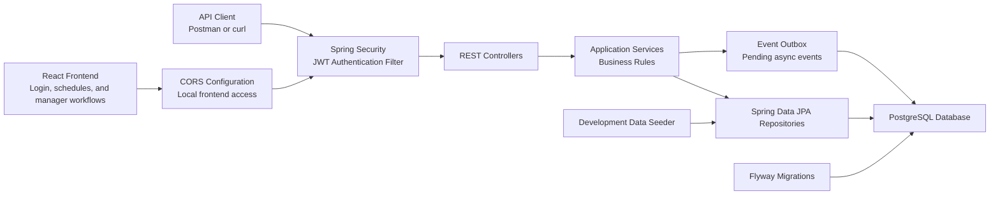

## Frontend Integration

The current frontend is intentionally small. It is responsible for:

- Displaying the login form.
- Calling `POST /api/auth/login`.
- Storing the returned JWT in browser local storage.
- Sending the JWT as a bearer token for authenticated API calls.
- Showing a manager or employee workspace based on the authenticated user's role.
- Loading the signed-in user's published schedules from `GET /api/schedules/me/published`.
- Loading a manager's teams from `GET /api/teams/me/managed`.
- Creating draft schedules through `POST /api/schedules`.
- Loading managed draft schedules from `GET /api/schedules/me/managed/drafts`.
- Creating shifts through `POST /api/schedules/{scheduleId}/shifts`.
- Loading draft schedule shifts from `GET /api/schedules/{scheduleId}/shifts`.
- Loading active team employees from `GET /api/teams/{teamId}/employees`.
- Loading draft schedule assignments from `GET /api/schedules/{scheduleId}/assignments`.
- Creating manual assignments through `POST /api/assignments`.

The backend remains the authority for authentication, authorization, validation,
business rules, and persistence.

## Backend Packages

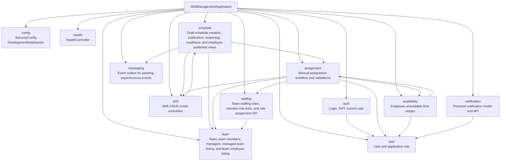

## Layer Pattern

Most feature packages follow this pattern:

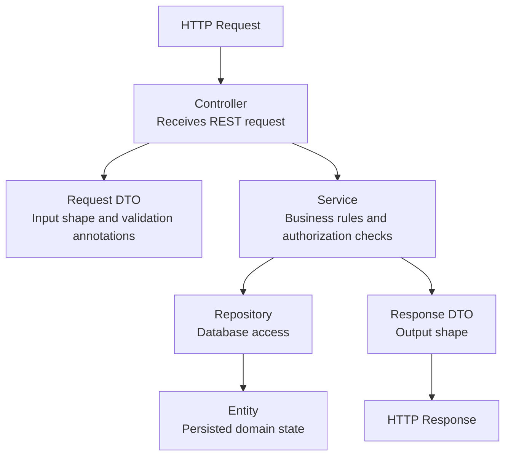

Not every package has every layer yet.
For example, the basic schedule lifecycle, publication readiness report, explicit unfilled-publication confirmation, and employee published schedule views are already implemented.

## Domain Model

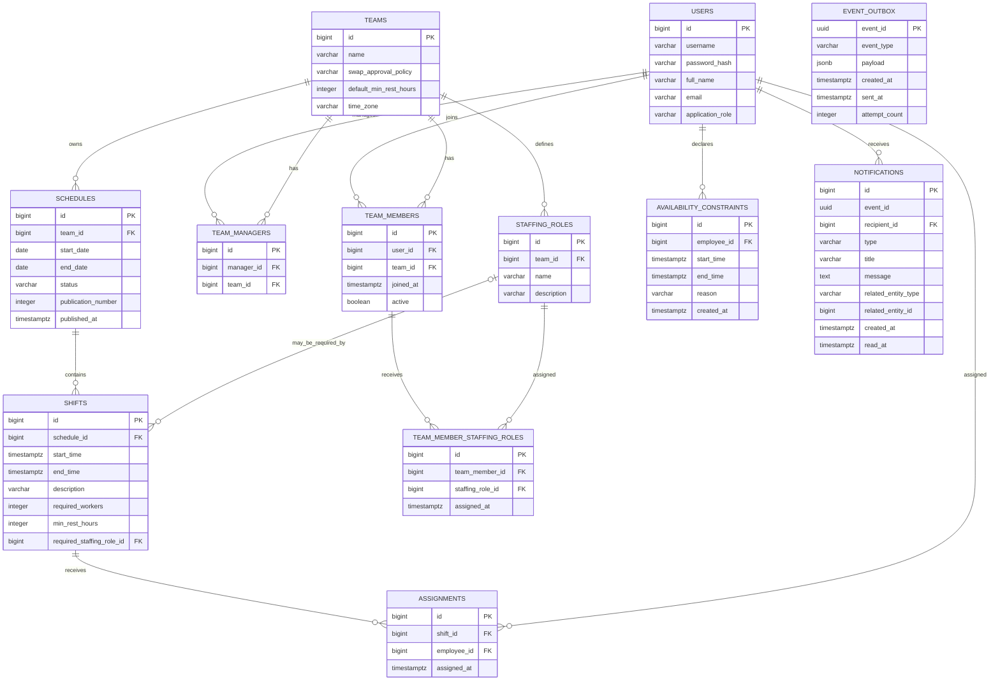

## Implemented API Areas

```mermaid
flowchart TD
    api["REST API"]

    healthApi["Health<br/>GET /api/health"]
    authApi["Authentication<br/>POST /api/auth/login<br/>GET /api/auth/me"]
    teamsApi["Teams<br/>GET /api/teams/me/managed"]
    schedulesApi["Schedules<br/>POST /api/schedules<br/>GET /api/schedules/me/published<br/>GET /api/schedules/me/published/{scheduleId}<br/>GET /api/schedules/me/managed/drafts<br/>GET /api/schedules/{scheduleId}/publication-readiness<br/>POST /api/schedules/{scheduleId}/publish<br/>POST /api/schedules/{scheduleId}/reopen"]
    shiftsApi["Shifts<br/>POST /api/schedules/{scheduleId}/shifts<br/>GET /api/schedules/{scheduleId}/shifts<br/>PUT /api/schedules/{scheduleId}/shifts/{shiftId}<br/>DELETE /api/schedules/{scheduleId}/shifts/{shiftId}"]
    assignmentsApi["Assignments<br/>POST /api/assignments<br/>GET /api/schedules/{scheduleId}/assignments<br/>DELETE /api/assignments/{assignmentId}"]
    availabilityApi["Availability Constraints<br/>POST /api/availability-constraints<br/>GET /api/availability-constraints/me<br/>DELETE /api/availability-constraints/{constraintId}"]
    staffingApi["Staffing Roles<br/>POST /api/teams/{teamId}/staffing-roles<br/>GET /api/teams/{teamId}/staffing-roles<br/>POST /api/teams/{teamId}/employees/{employeeId}/staffing-roles<br/>GET /api/teams/{teamId}/employees/{employeeId}/staffing-roles"]
    notificationApi["Notifications<br/>GET /api/notifications<br/>GET /api/notifications/unread-count<br/>POST /api/notifications/{notificationId}/read"]

    api --> healthApi
    api --> authApi
    api --> teamsApi
    api --> schedulesApi
    api --> shiftsApi
    api --> assignmentsApi
    api --> availabilityApi
    api --> staffingApi
    api --> notificationApi
```

Assignment creation validates required staffing roles when a shift has a professional role requirement.

## Main Request Flow Examples

### Login

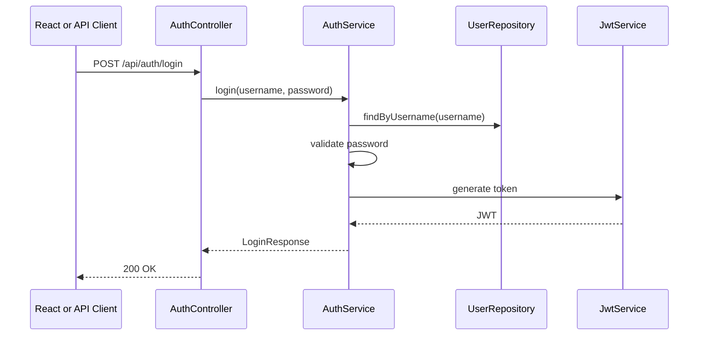

### Schedule Publication

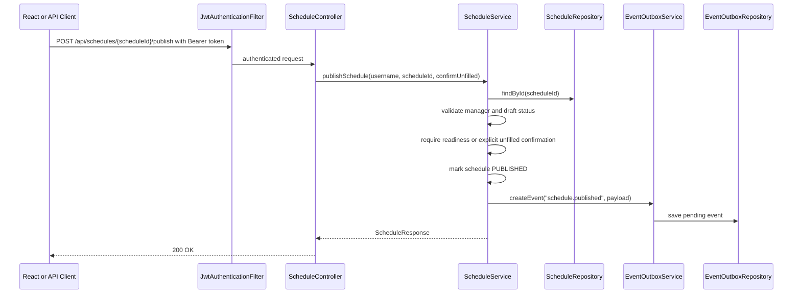

### Notification List And Read State

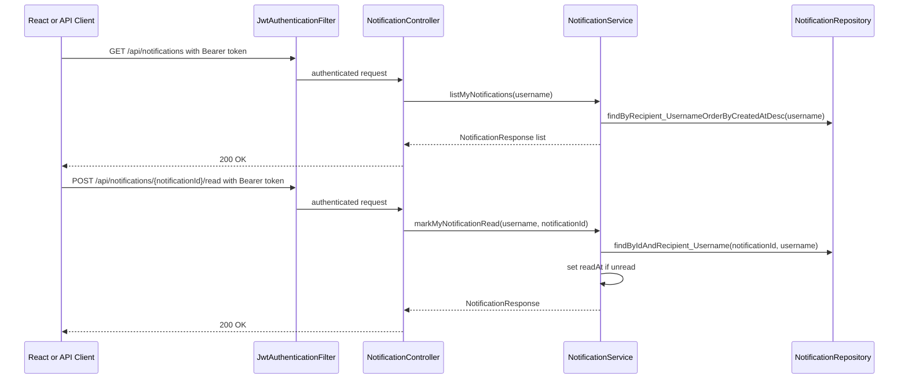

### Publication Readiness

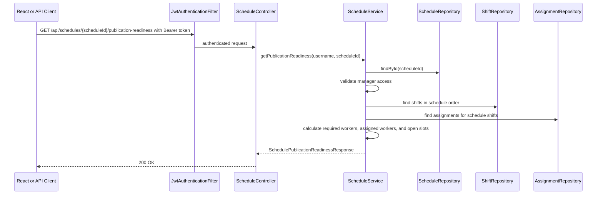

### Schedule Reopening

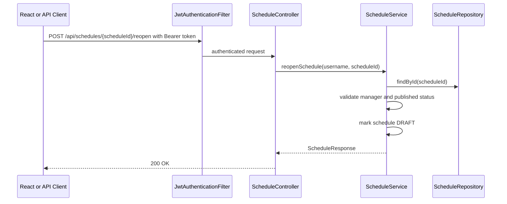

### Employee Published Schedule List

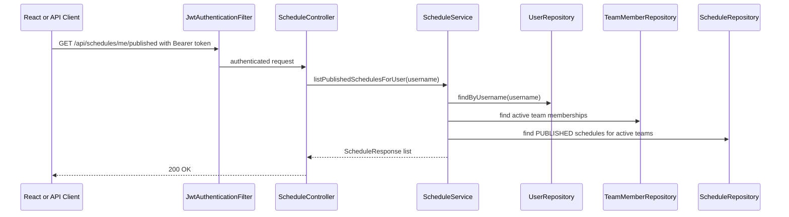

### Employee Published Schedule Details

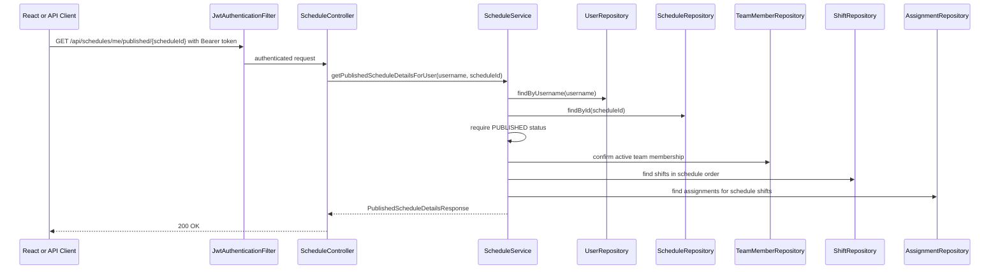

### Manual Assignment

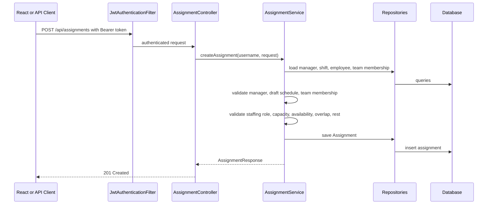

### Availability Constraint

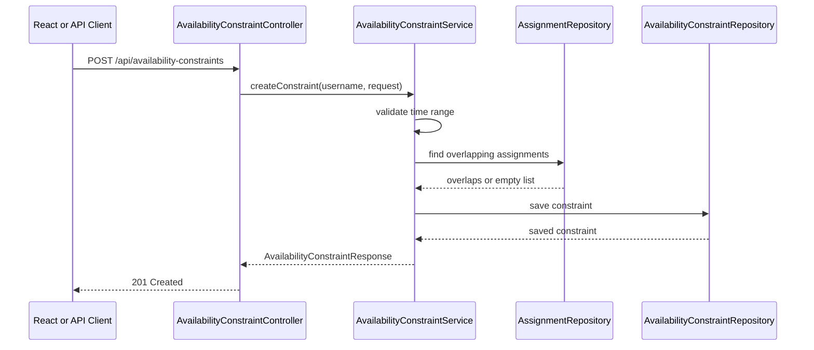

## Database Migration Timeline

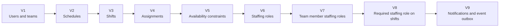

## Component Responsibilities

| Area | Responsibility |
| --- | --- |
| `auth` | Login, JWT creation, JWT request authentication, current user endpoint. |
| `config` | Security configuration and local development seed data. |
| `health` | Public health check endpoint. |
| `user` | User entity and broad application role such as `MANAGER` or `EMPLOYEE`. |
| `team` | Teams, active team membership, team managers, and managed team listing for manager UI. |
| `schedule` | Draft schedule creation, managed draft schedule listing, schedule publication, explicit unfilled-publication confirmation, schedule reopening, publication readiness, employee published schedule list/details, and schedule lifecycle state fields. |
| `shift` | Shift creation, listing, update, deletion, schedule-range validation, and optional required staffing role storage. |
| `assignment` | Manual assignment creation/list/delete and business rule validation, including capacity, availability, overlap, rest, and required staffing roles. |
| `availability` | Employee unavailable time ranges and conflict checks with assignments. |
| `staffing` | Team-specific professional roles, role create/list API, employee role assignment/list API, and persistence for assigning roles to team members. |
| `messaging` | Event outbox persistence and event creation for future JMS delivery. |
| `notification` | Personal notifications, unread count, mark-as-read behavior, and idempotent notification creation. |
| Flyway migrations | Versioned PostgreSQL schema changes. |
| PostgreSQL | Persistent relational storage. |
