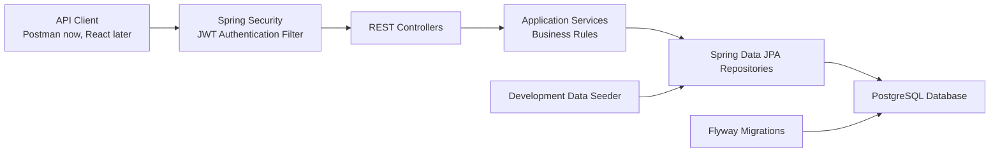
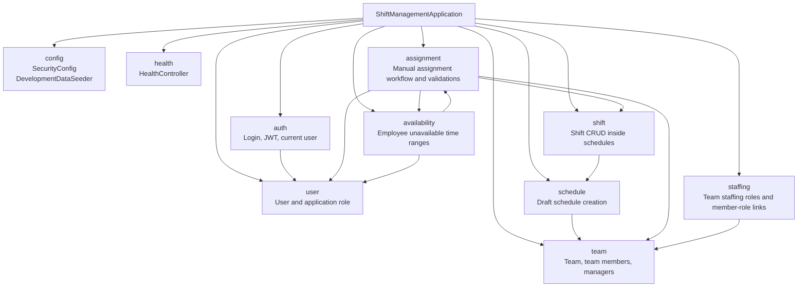
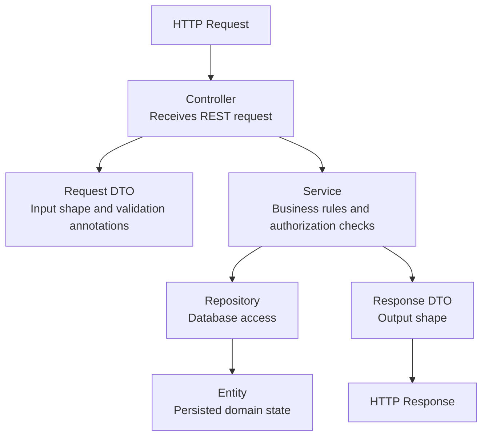
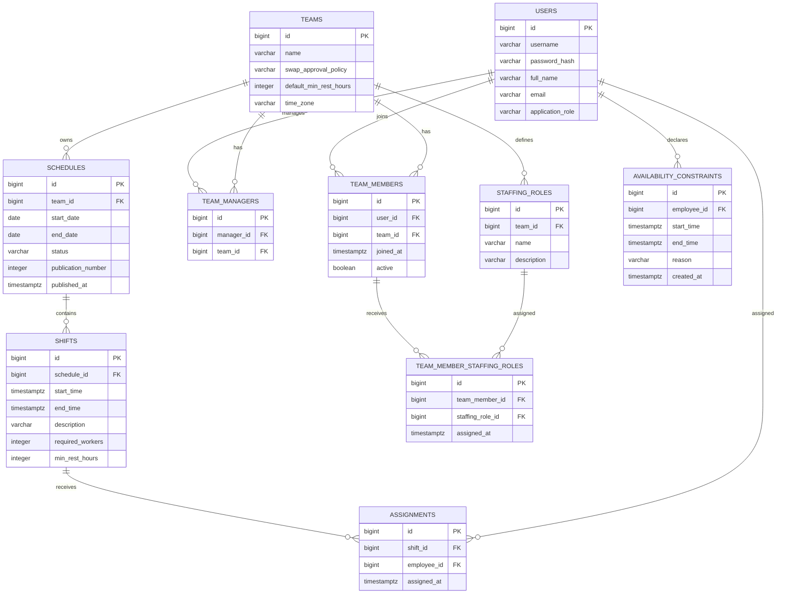
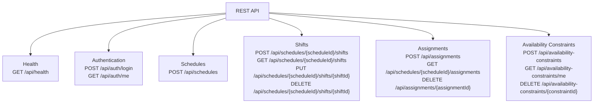
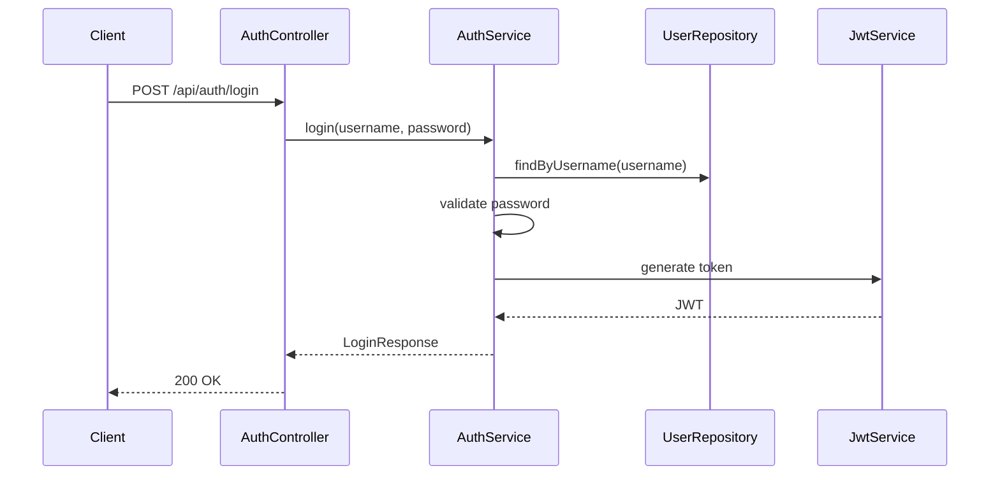
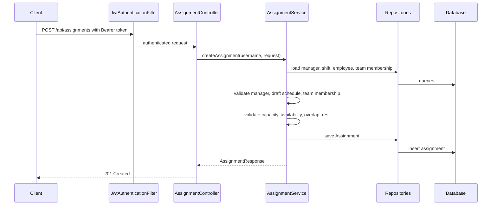
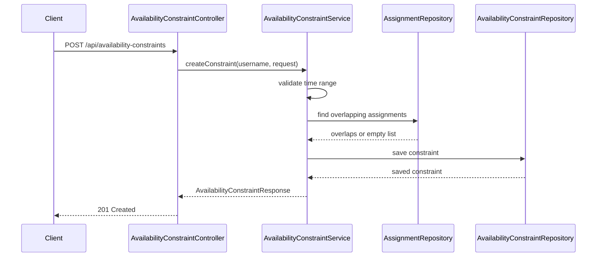
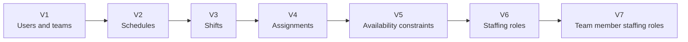

# Current Backend Architecture

This document describes the backend components that currently exist in the project.
It intentionally documents the implemented state only, not future planned features.

## System Context

## Backend Packages

## Layer Pattern

Most feature packages follow this pattern:

Not every package has every layer yet.
For example, `staffing` currently has entities and repositories only, with no REST API yet.

## Domain Model

## Implemented API Areas

Staffing roles do not have API endpoints yet.
They currently exist only as persistence components.

## Main Request Flow Examples

### Login

### Manual Assignment

### Availability Constraint

## Database Migration Timeline

## Component Responsibilities

| Area | Responsibility |
| --- | --- |
| `auth` | Login, JWT creation, JWT request authentication, current user endpoint. |
| `config` | Security configuration and local development seed data. |
| `health` | Public health check endpoint. |
| `user` | User entity and broad application role such as `MANAGER` or `EMPLOYEE`. |
| `team` | Teams, active team membership, and team managers. |
| `schedule` | Draft schedule creation and schedule lifecycle state fields. |
| `shift` | Shift creation, listing, update, deletion, and schedule-range validation. |
| `assignment` | Manual assignment creation/list/delete and business rule validation. |
| `availability` | Employee unavailable time ranges and conflict checks with assignments. |
| `staffing` | Team-specific professional roles and persistence for assigning those roles to team members. |
| Flyway migrations | Versioned PostgreSQL schema changes. |
| PostgreSQL | Persistent relational storage. |
