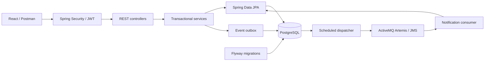
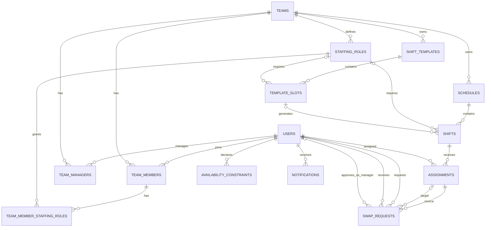
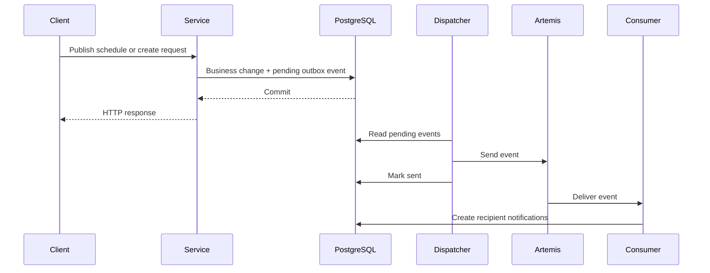

# System Architecture

This document describes the implemented system. Setup, tests, and API examples
are in [Run Locally](RUN_LOCALLY.md); the release scope is summarized in
[Current Scope](../README.md#current-scope).

## System Context



The backend is authoritative for authorization, validation, and persistence.
Postman and the React UI use the same API and database. JMS is an asynchronous
notification path, not the mechanism that performs the employee assignment.

## Layers And OOP

Code is grouped by business feature rather than in one global controller/service
folder. Most features use this flow:

```text
HTTP + request DTO -> controller -> service -> repository -> entity/database
                                 -> response DTO -> HTTP response
```

- Controllers translate HTTP input and obtain identity from Spring Security.
- Request DTOs define input shape and Bean Validation constraints; response DTOs
  avoid exposing persistence entities or password hashes directly.
- Services own use cases, authorization checks, and transaction boundaries.
- Entities encapsulate persisted state and domain transitions such as publishing,
  request approval, and assignment transfer.
- Spring Data repositories handle persistence. Constructor injection supplies
  collaborators; application code does not manually construct services.
- Shared helpers have specific responsibilities: `AssignmentValidator` checks
  eligibility, `SwapRequestExecutor` executes approved requests, and
  `ScheduleWriteLock` coordinates scheduling writes.

This is a layered REST backend with a separate React view, not server-rendered
Spring MVC templates. The implementation uses composition and shared validation;
it does not implement the originally proposed interface-per-assignment-rule design.

## Module Map

Backend source: [com.hilimor.shiftmanagement](../shift-management-backend/src/main/java/com/hilimor/shiftmanagement).

| Package | Responsibility |
| --- | --- |
| `auth`, `user`, `config` | Login, JWT, users/application roles, security, opt-in initialization. |
| `team` | Team memberships and managers, scoped listing, transactional new-employee creation. |
| `schedule` | Draft lifecycle, publication/readiness, published views, write locks and deletion revisions. |
| `shift` | Shift CRUD, schedule-date checks, versioned editing and existing-assignment validation. |
| `assignment` | Manual/automatic assignment, removal, shared eligibility validation. |
| `availability` | Personal unavailable time ranges and conflict checks. |
| `staffing` | Team-specific professional roles and member-role links. |
| `template` | Reusable shift patterns, slots and dated shift generation. |
| `request` | Transfer/swap state machine, authorization, locking and atomic execution. |
| `messaging` | Event outbox, event serialization and scheduled JMS dispatch. |
| `notification` | JMS event consumption, recipient notifications and read state. |
| `error`, `health` | Consistent API errors and public health check. |

Frontend source: [src](../shift-management-frontend/src).
`App.jsx` composes the workspace; `components/` contains screen sections and
manager panels; `hooks/` manages workflow state and loading; `api.js` handles
HTTP calls; `i18n/` supplies Hebrew/English text and direction.

The manager workflow shares one selected draft across draft, build, assign, and
publish steps. Templates belong to teams, not to the selected draft. Generating
shifts from a template changes that draft; editing template definitions does not.

Published schedules support Sunday-first weekly/monthly calendars and a list.
Employees can filter to their own shifts while still seeing coworkers in those
shifts. Displayed dates use the browser timezone; overnight shifts appear on their
start date. The published-schedules hook ignores obsolete success/error/loading
responses after selection changes, refreshes, and reset. This protection is not
a claim that every async hook has undergone the same verification.

## Domain And Persistence



The diagram shows relationships, not every column. The standalone `event_outbox`
table stores event UUID, type, JSON payload, creation/sent times, and failed-attempt
count. Notifications carry the event UUID and recipient; their unique pair
prevents duplicate rows for the same delivery.

[SQL migrations](../shift-management-backend/src/main/resources/db/migration)
are the schema source of truth: V1-V8 introduce users/teams, scheduling,
availability and staffing; V9 adds messaging; V10 requests; V11 templates;
V12 generated-shift uniqueness; V13 active swap-target uniqueness; V14 renames
the seeded daily template. Existing migrations are not rewritten to reset data.
Hibernate uses `ddl-auto: validate` and `open-in-view: false`.

## Authentication And Administration

Only health and login are public API endpoints. The JWT filter validates the
token and sets the authenticated identity. Services resolve that identity and
check team access; supplying a team ID or another username is not authorization.

`MANAGER` is an application role, distinct from professional staffing roles.
A manager also needs a `team_managers` association with the target team.
Employee published views require active membership and `PUBLISHED` status.
Notification access is recipient-scoped; request actions check ownership and
the current approval stage.

`TeamEmployeeService.createEmployee` creates a new `EMPLOYEE` account, active
membership and optional existing team roles atomically. Username is case-sensitive
and unique, 3-100 ASCII letters/digits/dots/underscores/hyphens, starting with a
letter or digit. Full name may be Hebrew and need not be unique (maximum 200
characters). Email is optional, at most 255 characters; blank becomes null.
Passwords require at least eight characters and at most 72 UTF-8 bytes, and are
stored using BCrypt. Responses never include passwords/hashes. Concurrent
duplicate usernames are also rejected by a database unique constraint.

The manager supplies and privately shares the initial password. There is no
password reset/change, invitation, or mandatory first-login replacement.
This endpoint cannot create a manager or add an existing account to a team.
There is currently no team/manager creation API or screen: initial administration
requires controlled database provisioning of `users`, `teams` and
`team_managers`, with correctly hashed passwords. This is a limitation, not a
normal manager workflow. The initializer does not top up an existing database.

## Scheduling Rules

`AssignmentValidator` checks active team membership, required staffing role,
duplicates, capacity, unavailable times, overlapping assignments and minimum rest.
Checks include assignments in other schedules/teams. Availability means time when
the employee **cannot** work. Creating a constraint that overlaps an existing
assignment is rejected; it does not silently remove that assignment.

Manual creation assigns one employee. Automatic assignment processes shifts
chronologically, ranks candidates by fewer assigned minutes in the current
schedule, and returns created assignments and remaining open slots. It is a
greedy baseline, not a global optimizer or a guarantee of complete staffing.

A template defines a repeating cycle of slots. A one-day cycle with three
eight-hour slots generates 21 shifts over seven days or 63 over 21 days.
Generation uses the team's timezone, validates the destination draft, and skips
already-generated occurrences. It does not assign a recurring employee.
Unused-template deletion is supported; template/slot editing and individual
slot deletion are not.

Schedules follow `DRAFT -> PUBLISHED -> DRAFT`. Reopening changes the same
schedule record and keeps its shifts/assignments, not an archived copy.
Readiness is a read-only preview of staffing and assignment validity, not a
reservation. Publishing revalidates under locks. `confirmUnfilled` allows staffing
gaps, never invalid employee assignments. Invalid publication creates no outbox
event. Editing a published schedule requires reopening it first.

The UI supports shift editing in the build step. Proposed times, capacity, rest
and role are checked against current assignments. A failure rolls back all edited
fields and leaves assignment owners unchanged. Shift edits and manual/automatic
assignments do not currently emit JMS notifications; publication does.

## Transactions And Concurrency

Service transactions own commit/rollback. `ScheduleWriteLock` and
`SwapRequestLock` coordinate participating writes using PostgreSQL locks:

1. Lock the owning team and refresh state loaded before waiting.
2. Lock any needed shifts in ascending ID order.
3. Lock affected employees in ascending ID order.
4. Revalidate and persist; release locks when the transaction completes.

Manual/automatic assignment, request execution, publication/reopening, draft
deletion, shift writes, assignment deletion and template mutations use this
protocol. Employee creation also uses the team lock. Availability writes take
only the employee lock and never subsequently wait for team/shift locks.

This deliberately serializes scheduling writes within one team. Different teams
can proceed independently unless they share locked employees. It protects
cross-schedule overlap/rest as well as same-shift capacity. An in-memory
`synchronized` block alone would not protect separate backend processes.

A waiting operation checks committed state: publication may now make a write
invalid (`409`), or deletion may leave a missing record (`404`). Deterministic
lock ordering reduces deadlock risk; it does not make all future writers safe.
Existing staffing-role writes and future team/member/role lifecycle changes are
not claimed to have complete coverage by this protocol. Broad load testing and
multi-instance messaging verification remain outstanding.

### Stale Edits And Confirmed Deletion

Shift PUT requests must send the non-negative `version` originally read.
The service compares it after locking/refreshing and uses JPA `@Version`;
stale edits return `409 STALE_VERSION`. A successful response includes the saved
version. A no-op need not increment it. Reload and review before retrying.

Draft, template, shift and assignment deletions require a fresh authorized
preview and its unchanged `revision` query parameter. `DeletionRevision` hashes
parent/child IDs and versions; parent versions alone would miss child changes.
DELETE repeats authorization and eligibility checks under locks and compares the
snapshot before removing anything. Preview does not hold a lock while the user
decides, and the revision is not a credential.

Cancel sends no DELETE. Invalid revisions return `400`, changed data `409`,
and missing records `404`. There is no automatic refresh-and-retry of deletion.
Draft/shift deletion can remove contained assignments; assignment deletion
preserves the shift. Source/target request history blocks deletion regardless of
request status. Used templates cannot be deleted.

## Transfer And Swap Execution

Requests start as `PENDING_EMPLOYEE`. Target approval either executes directly
under the team's `EMPLOYEE` policy or moves to `PENDING_MANAGER` under
`MANAGER` policy. The manager sees active requests but can approve only at the
manager stage. The target may reject; the requester may cancel an active request.

`SwapRequestService` owns the transaction. `SwapRequestExecutor` requires it
with `Propagation.MANDATORY`. After team/shift/employee locks, it validates the
resulting assignment(s); swaps ignore the assignment each person is giving up.
Both swap legs must pass before either owner changes.

A business eligibility failure is caught inside this transaction and commits
`INVALIDATED` without transferring ownership. The response is `200` with that
status, not a successful swap. The shared validator has no inner transactional
service boundary that would mark this handled failure rollback-only. Unexpected
database errors still roll back the whole operation.

Successful execution changes assignment owners and invalidates competing active
requests in the same transaction. Team locking also covers cross-column conflicts
that separate source/target unique indexes cannot prevent alone. Duplicate
approvals or approval after cancellation/invalidation return `409`.

## JMS And Notifications



The diagram is a typical ordering, not a guarantee that the HTTP response arrives
before consumption. Delivery is independent after commit; the request does not
wait for notification creation.

| Event | Recipients |
| --- | --- |
| `schedule.published` | Active team members. |
| `request.created` | Target employee and team managers, for transfers and swaps. |

`OutboxEventDispatcher` polls up to 50 pending events every five seconds by
default, sends JSON to `notification.events`, then marks the event sent. A send
or serialization failure increments `attempt_count`; the row remains pending.
`sent_at` means dispatch, not proof that every recipient notification exists.

Database commit and JMS send are not one distributed transaction. Delivery may
repeat, for example after a send succeeds but the outbox update rolls back.
Notification creation checks the event/recipient pair and has a database unique
constraint. This is not an exactly-once delivery guarantee, a verified
multi-dispatcher design, or a completed broker recovery/DLQ implementation.
Unsupported event types are currently ignored by the consumer. There is no
application DLQ viewer or replay workflow.

Notifications are persisted separately from broker messages. A consumed queue can
be empty while notifications remain visible in the application/DB. HTTP
validation failures such as `409` are API responses, not automatically JMS events.
The notification center reads the API and can mark notifications as read.
Event messages may contain an earlier snapshot; request/schedule details are the
current state. Some generated notification text remains English.

## Errors, Logging And Verification

API and security errors use `status`, `error`, `code`, `message`, `path` and
`timestamp`. Common codes include `VALIDATION_ERROR`, `MALFORMED_REQUEST`,
`UNAUTHORIZED`, `FORBIDDEN`, `NOT_FOUND`, `STALE_VERSION`,
`CONCURRENT_MODIFICATION`, and business codes such as `SHIFT_OVERLAP`,
`SHIFT_CAPACITY` and `MINIMUM_REST`. Expected lock failures/timeouts map to
`409`; unrelated database failures are not indiscriminately relabeled.

SLF4J/Spring Boot logs identify workflow events by schedule, employee, request
and event IDs. They are operational logs, not an audit-log feature. Passwords,
JWTs and full request bodies are not intentionally logged.

Unit tests isolate collaborators; PostgreSQL tests verify real migrations,
transactions, lock waits and stored outcomes. MockMvc tests that inject a test
identity do not prove login/JWT or browser behavior. Focused frontend tests and
the response-ordering fixture do not replace live end-to-end testing.
See [commands and representative tests](RUN_LOCALLY.md#verification).

## Demo Initialization

`DevelopmentDataSeeder` is disabled by default. Explicit initialization takes a
transaction-scoped advisory lock, then checks users, teams and the independent
outbox table before creating the scenario. Existing/partial databases are skipped.
Failure rolls back the scenario, and concurrent initializers do not seed twice.

Dates are chosen once. Restarting never restores transferred/deleted data or
adopts a manual schedule by date. Preloaded notifications and the preloaded
request are fixtures, not proof of JMS delivery. Use a new real API action to
demonstrate the event pipeline. [Run Locally](RUN_LOCALLY.md) contains the explicit
first-start command and the destructive-reset warning.
